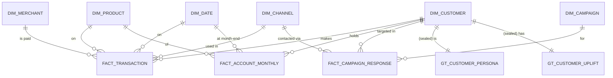

# Data model

Stage 1 deliverable. Defines the dimensional model the generator fills and the
SQL/Spark layers read. **All data is synthetic** (see `src/generator`).

## The business scenario

An existing-customer **credit-card cross-sell**. Every synthetic customer already
holds a current account and debit card with ~12 months of transaction history. A
campaign offers them a credit card. We measure the campaign's *incremental* effect
on card take-up — not the raw take-up rate, which is inflated by customers who would
have taken the card anyway.

**Response is defined as:** the customer opened *and* activated a credit card within
the measurement window (contact date + 60 days). "Activated" = at least one credit
card transaction. Opening without a first transaction does **not** count — dormant
cards earn the bank nothing, so they must not count as a win.

## Modelling approach

A **star schema** (Kimball): narrow, denormalised dimensions around fact tables that
hold the events and measures. Chosen over a normalised (3NF) model because the
consumers are analytical — Power BI, aggregation SQL, and feature engineering — where
star schemas are simpler to query and Power BI's engine is explicitly built for them.

### Get the grain right first

A fact table's **grain** is what one row represents. Fix it before anything else;
every measure and every join depends on it.

| Table | Type | Grain — *one row per…* |
| --- | --- | --- |
| `fact_transaction` | transaction | one card/account transaction |
| `fact_account_monthly` | periodic snapshot | one customer × product × month-end |
| `fact_campaign_response` | accumulating snapshot | one customer × campaign |
| `dim_customer` | dimension | one customer |
| `dim_product` | dimension | one banking product |
| `dim_merchant` | dimension | one merchant |
| `dim_channel` | dimension | one interaction channel |
| `dim_date` | dimension | one calendar day |
| `dim_campaign` | dimension | one campaign |

Three fact tables, three deliberately different grains — that mix (a transaction
fact, a periodic snapshot, an accumulating snapshot) is itself a signal that the
modelling was thought through rather than dumped into one big table.

## Entity–relationship diagram

## Dimensions

### `dim_customer`
Attributes only — **no ground truth here** (see below). Age band, gender, region/city,
relationship start date and tenure, income band, employment type, existing product
count, digital-engagement flag. Surrogate key `customer_sk`.

### `dim_product`
The retail product catalogue: current account, debit card, credit card, savings
account, term deposit, consumer loan. `product_sk`, product name, product group,
a flag for whether it's the campaign's target product.

### `dim_merchant`
One row per merchant, **denormalising MCC into the dimension**: `merchant_sk`,
merchant name, `mcc_code`, `mcc_category` (grocery, dining, travel, fuel, utilities,
e-commerce, entertainment, …). MCC category is what the segmentation aggregates spend
by, so it must be easy to reach — hence denormalised, not a separate lookup.

### `dim_channel`
`channel_sk`, channel name: POS, e-commerce, ATM, mobile app, internet bank, branch,
transfer. Feeds the digital-engagement features.

### `dim_date`
Standard calendar dimension, one row per day across the history. Year, quarter,
month, month name, day-of-week, weekday/weekend flag, month-end flag. Every
time-based analysis and every Power BI time intelligence measure hangs off this.

### `dim_campaign`
`campaign_sk`, campaign name, target `product_sk`, start/end dates, contact channel,
cost per contact. Modelled as a full dimension (not a constant) so the design scales
to many campaigns even though this project runs one.

## Fact tables

### `fact_transaction` — the behavioural engine
**Grain:** one transaction. The large table (target ~10–25M rows). FKs to customer,
merchant, channel, product, date. Measures: amount, direction (debit/credit),
transaction type. Everything behavioural — RFM, category spend shares, channel mix,
balance volatility, income regularity — is derived from this.

### `fact_account_monthly` — periodic snapshot
**Grain:** one customer × product × month-end. Whether the customer holds the product
that month, end-of-month balance, whether it was opened that month. Gives penetration
and balance trends over time without scanning every transaction.

### `fact_campaign_response` — the experiment
**Grain:** one customer × campaign. The measurement table. Columns: assignment
(`treatment` / `control`), contacted flag, contact date, responded flag, response
date, card-opened flag, first-activation date, and a revenue proxy for a responder.
The **control group is a randomised holdout** — treated and control customers are
drawn from the same population so the response-rate difference estimates true uplift.

## Ground truth — sealed, outside the star

Generated because we plant it; **withheld from the analysis** so validation is honest.
Kept in a separate schema (`gt_`). The modelling code must not join to these while
building segments or the uplift model — they are opened only to score the results.

### `gt_customer_persona`
`customer_sk` → true persona label (e.g. *Young Digital Spender*, *Family Anchor*,
*Affluent Saver*, *Dormant Minimalist*, *Cash-Heavy Traditionalist*). The generator
draws each customer's behaviour from their persona; segmentation must **rediscover**
these from behaviour alone. Scored with Adjusted Rand Index / cluster purity.

### `gt_customer_uplift`
`customer_sk` → true propensity to take the card without contact, and true *uplift*
(the causal lift the campaign adds for that customer). Lets us grade the uplift
model against the real effect and quantify how far the naive responders-vs-non
read drifts from truth.

## Naming & keys

- Surrogate keys everywhere (`*_sk`), integer, generated — never rely on a natural
  key like an account number as a join key.
- Tables: `dim_`, `fact_`, `gt_` prefixes. snake_case throughout.
- Every fact FK has a matching PK in its dimension; enforced in DDL.

## Open questions for stage 2 (the generator)

- Exact persona count and their behavioural fingerprints.
- How persona maps to the four uplift archetypes (persuadable, sure-thing,
  lost-cause, sleeping-dog).
- Seasonality and salary-cycle shape in the transaction stream