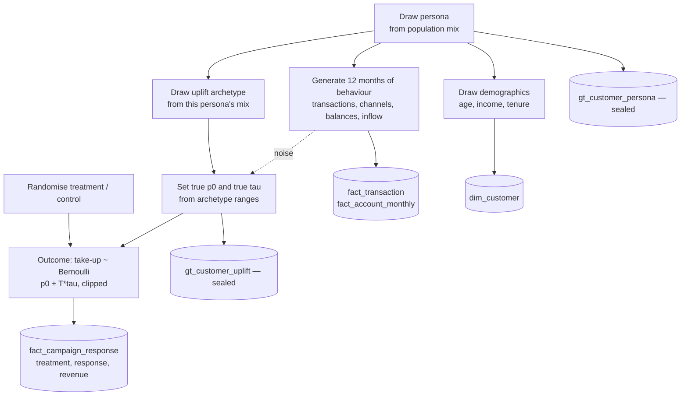

# Generator design

Stage 2. How synthetic data is produced, and how the ground truth is planted so
stages 4–5 can be validated. Numeric parameters live in `src/generator/config.py`;
**this document explains the design, that file holds the exact values to review.**

## The core idea

Generate every observable fact — customers, transactions, balances, campaign
outcomes — from two *hidden* traits per customer that a real bank could never see:

1. a **persona** — a behavioural type the segmentation must rediscover;
2. an **uplift archetype** — how the customer responds to the campaign, giving a true
   baseline propensity `p0` and true uplift `τ`.

Because we plant them, we can seal them away (`gt_` tables, decision record 0002) and
at the end score how well the models recovered them.

## Layer 1 — Personas

Six personas, each grounded in Bank of Georgia's real retail structure (the Student
Card segment, Mass Retail / Plus+ loyalty, SOLO premium banking) plus demographically
distinct Georgian-market groups. Segmentation (stage 4) sees only behaviour and must
recover these clusters.

| Persona | BoG anchor | Age | Income | Spends like… | Channel lean | Balance |
| --- | --- | --- | --- | --- | --- | --- |
| **Student / Young Digital** | Student Card | 18–26 | low | dining, e-commerce, entertainment, transport | all-digital, no cash | low, volatile |
| **Mass-Retail Family** | Mass Retail / Plus+ | 33–50 | mid | groceries, utilities, healthcare, fuel | POS + mobile, some cash | moderate, stable |
| **SOLO Affluent** | SOLO premium | 35–55 | high | travel, premium dining, retail | mobile + POS, low cash | high, growing |
| **Cash Traditionalist** | mass, low-digital | 45–65 | low–mid | groceries, fuel, utilities, pharmacy | heavy ATM + branch | moderate, flat |
| **Pensioner** | pension accounts | 63–80 | low | groceries, healthcare, utilities | ATM + branch, minimal digital | low, flat |
| **Remittance Household** | migrant / remittance | 28–50 | low–mid | groceries, utilities, mixed | cash-out + some digital | low–moderate |

Population mix and every number (transaction frequency, GEL amounts, category spend
shares, channel shares, inflow, balance) are in `config.py`. **The GEL figures are a
first pass — tune them against the real market** (pensioner inflow especially: it
represents a modest Georgian state pension).

Personas are designed to be *recoverable but not trivially separable*: fingerprints
overlap at the edges (Pensioner and Cash Traditionalist both skew older, cash, and
essential spend), so the clustering has to work and won't score a perfect 100%. That
overlap is realistic and gives an honest result to discuss.

## Layer 2 — Uplift archetypes

Every customer is also assigned one of four response types. This is a **separate
trait** from persona — persona is *how you bank*, archetype is *how you respond to
this specific campaign* — and it is what the campaign actually acts on and what
stage 5's uplift model must recover.

| Archetype | Baseline `p0` | Uplift `τ` | Meaning | Targeting verdict |
| --- | --- | --- | --- | --- |
| **Persuadable** | low (~0.12) | **high positive** (~+0.20) | campaign genuinely converts them | **target — this is the goal** |
| **Sure-thing** | high (~0.55) | ~0 (~+0.03) | takes the card anyway | skip — contact is wasted spend |
| **Lost-cause** | very low (~0.04) | ~0 | won't take it either way | skip — no effect |
| **Sleeping-dog** | low–mid (~0.15) | **negative** (~−0.08) | contact annoys them, lowers take-up | **avoid — contact backfires** |

Treated take-up probability is `p1 = clip(p0 + τ, 0, 1)`; control take-up is `p0`.
Ranges (not point values) are drawn per customer, so each archetype has internal
spread — see `config.py`.

Sleeping-dogs are the reason uplift modelling beats propensity modelling: a
propensity model ranks by `p1` and may target them; only an uplift model sees that
contacting them is *worse* than leaving them alone.

## The link — persona and archetype are distinct but correlated

Persona and archetype are **two different latent variables, not the same thing** — but
they are **statistically dependent (correlated), not independent.** Knowing a
customer's persona shifts the probabilities over their archetype, via a per-persona
mixing distribution:

| Persona | Persuadable | Sure-thing | Lost-cause | Sleeping-dog |
| --- | --- | --- | --- | --- |
| Student / Young Digital | 0.48 | 0.27 | 0.20 | 0.05 |
| Mass-Retail Family | 0.50 | 0.25 | 0.20 | 0.05 |
| SOLO Affluent | 0.20 | 0.55 | 0.15 | 0.10 |
| Cash Traditionalist | 0.10 | 0.15 | 0.55 | 0.20 |
| Pensioner | 0.08 | 0.10 | 0.62 | 0.20 |
| Remittance Household | 0.35 | 0.18 | 0.37 | 0.10 |

> **Note on terminology:** if the two traits were *statistically independent*, every
> row of this table would be identical — persona would tell you nothing about
> response. They are clearly not identical, so the traits are dependent. They are
> modelled as *separate axes* (a persuadable and a sleeping-dog can both be Family
> Anchors) rather than collapsed into one, because in reality two customers in the
> same behavioural segment can respond to a campaign completely differently.
> Collapsing archetype into persona would assert everyone in a segment responds
> identically and make the uplift model pointless.

This is the spine of the project: the correlation makes segments **actionable**
("prioritise Student and Family, suppress Traditionalist and Pensioner"), while the
fact that it's only a *correlation* — not an identity — keeps an uplift model adding
value *within* each segment.

## Layer 3 — Generative flow

The dotted `noise` edge matters: `p0`/`τ` are drawn from the archetype **plus** a
small dependence on the customer's own behaviour (`BEHAVIOUR_UPLIFT_COUPLING`), so
uplift is partly learnable from features but never a clean function of persona alone.
Without it, perfect segmentation would trivially solve targeting; with it, the uplift
model earns its keep.

## Outcome mechanics

- **Response** = took up the card (opened **and** activated) within 60 days of
  contact. `p0`/`τ` govern this composite outcome directly, so non-activation is
  already priced into the propensity — keeps the causal arithmetic clean.
- **Treatment assignment** is a randomised holdout (default 70% treated / 30%
  control, configurable). Same population on both arms ⇒ the response-rate gap is an
  unbiased estimate of average uplift, the benchmark the model must beat on
  *targeting*.
- **Revenue proxy**: each activated card is assigned an annual-value estimate
  (interchange + revolving + fees), scaled by the customer's spend. Powers the ROI
  headline. **Cost per contact** comes from `dim_campaign`.

## How targeting uses all this (preview of stage 5)

Clustering describes *who behaves alike*; it does **not** decide who to target. The
uplift model decides, by ranking customers on predicted incremental take-up:

- **Segment level** — prioritise persuadable-heavy personas (Student, Family),
  suppress sleeping-dog/lost-cause-heavy ones (Traditionalist, Pensioner).
- **Individual level** — rank everyone by predicted uplift; target from the top until
  expected incremental revenue falls below cost per contact (the Qini-curve cutoff).
- **Never target everyone**, and explicitly **exclude negative-uplift** customers —
  contacting them destroys value.
- An uplift model needs a **past campaign with a control group** to train on, so the
  holdout isn't only for measuring this campaign — it's the training signal for
  targeting the next wave.

## What this buys the analysis

- Stage 4 scores clustering against `gt_customer_persona` (Adjusted Rand Index /
  purity), with `k` chosen **blind** (elbow + silhouette) and only *then* checked
  against the true six — see decision record 0003.
- Stage 5 scores the uplift model against `gt_customer_uplift`, and demonstrates the
  naive responders-minus-non-responders read is inflated **by a measurable amount**.
- The persona × archetype link makes segments actionable, which is the business story.
